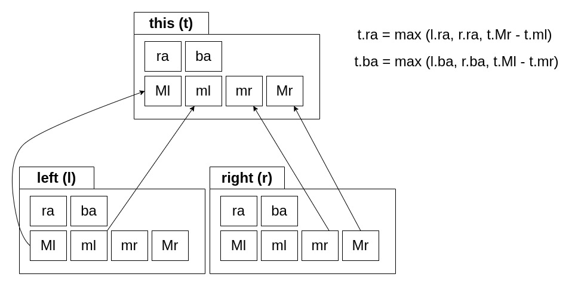

# Gifts Order

## Pseudocódigo

```cpp
    ll n, q, p, x;
    cin >> n >> q;
    vi a(2 * n);
    rep(0, n) { cin >> a[i]; }
    rep(0, (1 << (log2_floor(n) + 1))) update(1, 0, (1 << (log2_floor(n) + 1)) - 1, i, a[i], n);
    print(max(_ra[1], _ba[1]));
    rep(0, q)
    {
        cin >> p >> x;
        update(1, 0, (1 << (log2_floor(n) + 1)) - 1, p - 1, x, n);
        print(max(_ra[1], _ba[1]));
    }
```

## Explicación

Apuntes: En lo adelante se considerará 'M' como máximo, 'm' como mínimo, 'l' como left( izquierda ), 'r' como right( derecha ), 'b' como back( hacia atrás ) y 'a' como answer( respuesta ); Ml = (M + l), mr = (m + r), Mr = (M - r), ml = (m - l).

1. En el texto se presenta la función M - m - ( r - l ), la cual se puede reescribir como: [(M - r) - (m - l)] ó [(M + l) - (m + r)]. Simplificandolo a nuestra notación sería: Mr - ml, Ml - mr.
2. Las variables Ml, Mr, ml, mr se pueden calcular para cada elemento del conjunto sin necesidad de ninguna información externa.
3. Para cualquier conjunto tal que sea solución el máximo estará en un extremo y el mínimo en el otro, de no ser así aumentaría la diferencia r - l, pero M - m se mantendría, por lo cual empeoraría la respuesta, no sería máxima.
4. Luego solo existen dos casos posibles, o el máximo está a la derecha y el mínimo a la izquierda o viceversa. Esto sería ra = Mr - ml; ba = Ml - mr. Sin importar donde se encuentren estos. O la mejor respuesta a la izquierda o la mejor respuesta a la derecha respectivamente.
5. Para un subconjunto de elementos el Ml y el Mr son los máximos entre todos los Ml o Mr respectivamente, y de igual modo ocurre con los ml, mr, lo único que en este caso sería el mínimo.
6. Para construir dichos segment trees solo faltaría encontrar el neutro para cada uno de los valores. 1 es el mínimo valor que se alcanza en el conjunto, entonces 1 - pos será el menor valor que alcanzará Mr y 1 + pos será el menor valor que alcanzará Ml, luego como ambos son máximos estos serán sus valores por defecto. En el caso de los mínimos se sustituye por el máximo valor que se alacanzará que sería 1e9 más/menos pos respectivamente.
7. Se puede entonces construir un segment tree para cada uno de dichos valores.
8. En cuanto al resultado de calcular la funcion inicial, para cada subconjunto de un solo elemento el resultado siempre será 0, y para combinar dos subconjuntos teniendo precalculados Ml, Mr, ml, mr, ra y ba  para cada subconjunto calcular ra y ba para la unión sería:



7. Luego en el nodo principal del segment tree estarán almacenadas las mejores respuestas para todo el conjunto, solo resta hacer max(ra, ba) e imprimirlo.

## Complejidad

* Leer la entrada es O(n).
* Inicializar los segment trees es O( 6 n log n ) => O( n log n ).
* Hay q preguntas, y por cada una hay que leer dos elementos de la entrada (O(1)), actualizar los segment trees (O(log n)), e imprimir el máximo entre ra[1] y ba[1]; luego la complejidad queda en O(q log n).
* La complegidad total es la suma de las anteriores, q ue se calcula como la mayor de ellas, que es O ( n log n ).

(@_@)

## Link

[Gifts Order](https://codeforces.com/contest/2057/problem/D "Gifts Order")
